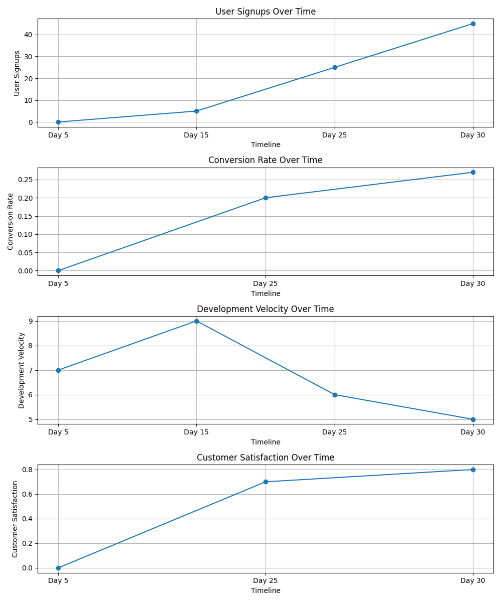

# AI Startup Simulator

A simulation tool that models the journey of launching a tech startup using AI agents with distinct roles. Track your startup's progress from initial market research through product launch, with realistic agent interactions and visualizations powered by CAMEL-inspired dialogue.

## Overview

This simulator creates a virtual startup team consisting of three key roles:
- **CEO**: Makes strategic decisions and resolves conflicts
- **Developer**: Evaluates technologies and estimates development effort
- **Marketer**: Analyzes markets and plans promotional activities

These agents collaborate through sophisticated dialogue systems, discussing technical approaches, marketing strategies, and business decisions throughout the startup journey.

The simulation progresses through four milestone periods:
1. **Days 1-5**: Market research & tech stack selection
2. **Days 6-15**: MVP development
3. **Days 16-25**: User testing & marketing prep
4. **Days 26-30**: Launch & analytics



## Features

- **AI-Powered Agents**: Each agent has a specialized role with domain-specific knowledge
- **Agent-to-Agent Dialogues**: CAMEL-inspired collaborative conversations between team members
- **Realistic Milestone Progression**: Simulates the key phases of startup development
- **Metric Tracking**: Monitors critical business metrics throughout the startup journey
- **Data Visualization**: Generates charts and graphs of startup performance
- **Team Dynamics Visualization**: Visual representation of team structure and relationships
- **Web Interface**: User-friendly interface for running simulations

## Installation

1. Clone this repository
2. Create a virtual environment:
   ```
   python -m venv .venv
   source .venv/bin/activate  # On Windows: .venv\Scripts\activate
   ```
3. Install dependencies:
   ```
   pip install -r requirements.txt
   ```
4. (Optional) Install system dependencies for visualization:
   ```
   # For Ubuntu/Debian
   sudo apt-get update
   sudo apt-get install graphviz
   ```
5. Set up your Anthropic API key:
   ```
   echo "ANTHROPIC_API_KEY=your-api-key-here" > .env
   ```

## Usage

### Command Line Interface

Run the simulator with your product idea:

```bash
python sim.py --product "build saas for ecommerce"
```

The simulation will run through all milestone periods, showing agent decisions, interactions, and inter-agent dialogues at each step, and generate visualization images.

### Web Interface

For a more interactive experience, use the web interface:

```bash
python api.py
```

Then open your browser to http://localhost:8000 and enter your product idea in the form.

## Architecture

The simulator consists of:

- `BaseAgent`: Abstract class providing the foundation for specialized agents
- `CAMELAgent`: Enhanced agent class that enables collaborative dialogues
- `CEOAgent`, `DeveloperAgent`, `MarketerAgent`: Role-specific agents with specialized prompts
- `StartupSimulation`: Orchestrates the simulation flow and agent interactions
- `SimulationVisualizer`: Creates visual representations of metrics and team dynamics
- `api.py`: Web interface for running simulations in the browser

The CAMEL-inspired architecture enables agents to:
1. Engage in multi-turn dialogues with other agents
2. Maintain consistent role-based expertise and personality
3. Collaboratively solve problems through structured conversations
4. Adapt responses based on previous exchanges

All agents use the Anthropic Claude API to generate responses appropriate to their role and context.

## Customization

You can customize the simulation by:

- Modifying the milestones in `MILESTONES` list
- Adding new agent types by extending `CAMELAgent`
- Changing the behavior of existing agents by modifying their `_create_prompt` methods
- Adjusting the simulation flow in the `_execute_milestone` method
- Modifying visualization styles in `SimulationVisualizer`
- Adding new metrics to track in the `metrics` dictionary
- Creating new dialogue patterns in the agent interaction methods
- Adjusting the number of conversation turns in agent dialogues

## Dependencies

- **Python 3.9+**
- **Anthropic SDK**: For agent intelligence
- **CAMEL-AI**: For agent dialogue capabilities
- **Matplotlib & NumPy**: For data visualization and analysis
- **Graphviz**: For team relationship visualization
- **FastAPI & Uvicorn**: For web interface
- **Jinja2**: For HTML templating
- **python-dotenv**: For environment variable management

## License

[MIT License](LICENSE)